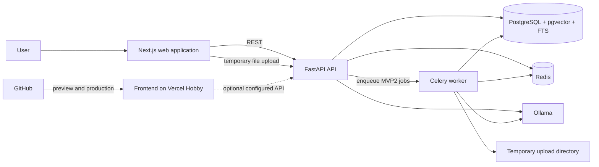

# Evidence-Grounded Writing Auditor — Implementation Plan

## 1. Product interpretation

The product is a local-first writing auditor delivered in two releases. It evaluates pasted text or uploaded documents, decomposes the writing into atomic claims, identifies research-writing risks, and proposes safer revisions. In the second release, it can verify claims against a private, project-specific set of reference documents.

The application is an evidence-alignment and writing-review tool. It must never describe itself as a scientific truth detector.

### MVP1: bilingual text audit

MVP1 accepts English or Slovak text pasted into a browser editor. It provides:

- Atomic claim extraction and claim classification.
- Deterministic checks for quantities and internal inconsistencies.
- Detection of causal, absolute, comparative, and scope overstatement.
- Explainable risk scores built from explicit components.
- Accessible color and underline highlighting in the editor.
- Claim-level explanations and suggested revisions.
- Revision and re-audit workflows.
- Local audit history.
- A working FastAPI API backed by a local Ollama instruction model.

MVP1 has no evidence corpus. It therefore must not label claims as scientifically supported, contradicted, or unsupported by research. Its statuses describe writing and verification risk:

- `low_risk`
- `review_recommended`
- `evidence_needed`
- `internally_inconsistent`
- `overstated`
- `not_verifiable`

### MVP2: file and evidence-grounded audit

MVP2 adds two explicitly separate workflows:

1. **Audit a document:** upload a PDF, DOCX, or LaTeX file whose writing will be audited.
2. **Add a reference source:** upload papers or documentation that define the evidence corpus for a project.

MVP2 provides:

- Machine-readable PDF, DOCX, and safe LaTeX text extraction.
- Page, section, source-line, and coordinate provenance where available.
- Hybrid lexical and vector retrieval over selected reference sources.
- Claim-to-evidence verification and counterevidence search.
- Evidence-specific numerical, causal, citation, and scope checks.
- An evidence inspector and optional reattachment of a local PDF for page viewing.
- Downloadable PDF audit reports.
- A structured claim ledger and audit history.

When no adequate evidence is found, the English interface must use exactly:

> This claim is not supported by the papers currently included in this project.

The Slovak locale uses a reviewed translation, while persisted results store a language-independent message key.

### Final assumptions

- There is no registration, login, authentication, user entity, or multi-user functionality.
- The application is a single-installation, single-workspace tool.
- The complete product must build and run without paid services.
- The fully functional deployment is local through Docker Compose.
- GitHub is the source of truth for version control and CI.
- The portfolio frontend is deployed to Vercel Hobby from GitHub.
- Vercel is not the runtime for local Ollama or document-processing workers.
- Ollama is the only required model runtime. No hosted-model fallback is allowed.
- Uploaded source files are temporary and are deleted after extraction.
- Extracted text, provenance, embeddings, audits, and reports may be persisted locally.
- English and Slovak are the only MVP languages.
- OCR, scanned PDFs, complex table/figure interpretation, plagiarism detection, external scholarly search, mathematical proof verification, and office/browser extensions remain out of scope.

---

## 2. MVP user journeys

### MVP1 journey

1. The user starts the local stack and opens the application.
2. The application checks FastAPI, PostgreSQL, Redis, and Ollama readiness.
3. The user selects English or Slovak. The preference is stored in browser local storage.
4. The user pastes or edits text in the audit editor.
5. The browser validates that the text is non-empty and within the configured limit.
6. The user selects **Audit text**.
7. FastAPI creates an immutable audit input and runs the bounded text-audit pipeline.
8. Ollama extracts atomic claims and returns validated structured judgments.
9. Python services run deterministic numerical and linguistic checks.
10. Versioned scoring rules calculate risk components and totals.
11. The editor highlights claims using color, underline patterns, and status labels.
12. Selecting a claim opens its classification, findings, risk components, explanation, and suggested revision.
13. The user applies a suggestion or edits the text manually.
14. Re-auditing creates a new immutable audit rather than mutating the old result.
15. The user can reopen previous audits from local history.

### MVP2 document-audit journey

1. The user creates or opens a local project.
2. The user chooses **Audit a document**.
3. The user uploads a machine-readable PDF, DOCX, or `.tex` file.
4. FastAPI streams the upload to a generated temporary path and creates a processing job.
5. A Celery worker validates and extracts the document.
6. The original file is deleted after extraction succeeds or fails.
7. The user reviews extracted text and any extraction warnings.
8. The user runs an audit using the same claim-oriented workspace as MVP1.
9. If reference sources are selected, evidence-grounded verification is included.
10. The user may generate and download a PDF audit report.

### MVP2 reference-source journey

1. The user opens the project's **Reference library**.
2. The user chooses **Add a reference source**.
3. A paper or documentation file is uploaded temporarily.
4. A worker extracts, segments, embeds, and indexes its text with provenance.
5. The original upload is deleted; the extracted corpus remains in PostgreSQL.
6. The user selects which ready sources belong to an audit.
7. Each atomic claim is retrieved and verified only against those sources.
8. Selecting evidence shows the exact passage, source name, page or structural location, verifier explanation, and safe revision.
9. If the user reselects the original local PDF, the browser verifies its content hash and enables original-page inspection for that session.

---

## 3. System architecture

### Architectural style

Use a modular monolith rather than microservices or an agent framework:

- One Next.js web application.
- One FastAPI backend package.
- One Celery worker process using the same backend package.
- PostgreSQL with pgvector as the authoritative store.
- Redis as the Celery broker and transient coordination layer.
- Ollama as the local instruction and embedding model runtime.
- Temporary local filesystem storage for uploaded originals.

The pipeline is implemented as explicit Python stages. LangGraph and other agent frameworks are not MVP dependencies.

### Runtime topology



### Local and Vercel modes

**Local full mode** is the acceptance target:

- All components run through Docker Compose or documented local commands.
- No paid account or service is necessary.
- The application works without internet after required container images and Ollama models have been downloaded.

**Vercel portfolio mode** provides:

- The public website and UI demonstration.
- GitHub preview deployments.
- Static fixture-based audit results when no backend is configured.
- A clear **Local API disconnected** state rather than a broken audit button.

Vercel cannot directly access an Ollama instance bound to a private computer. A public Vercel deployment is not considered proof that the complete local audit runtime is available. There must be no silent hosted-model fallback.

### Service responsibilities

- **Next.js:** editor, localization, state display, project screens, claim ledger, evidence inspector, PDF viewer, and API client.
- **FastAPI:** validation, persistence, synchronous MVP1 orchestration, project boundaries, job creation, result APIs, and report delivery.
- **Celery:** MVP2 extraction, embeddings, retrieval/verification batches, cleanup, and report generation.
- **PostgreSQL:** audits, documents, extracted content, provenance, full-text indexes, vectors, and version manifests.
- **Redis:** task broker, short-lived locks, progress coordination, and rate controls; never the authoritative audit store.
- **Ollama:** structured claim extraction, verification, revision generation, and embeddings through explicit adapters.

---

## 4. Repository and GitHub structure

```text
ai-response-auditor/
├── apps/
│   ├── web/                       # Next.js application and Vercel root
│   ├── api/                       # FastAPI entrypoint
│   └── worker/                    # Celery entrypoint
├── backend/
│   ├── auditor/
│   │   ├── domain/                # Enums, invariants, scoring policies
│   │   ├── db/                    # SQLAlchemy models and repositories
│   │   ├── audits/                # Explicit pipeline stages
│   │   ├── checks/                # Deterministic checks
│   │   ├── documents/             # Format validation and extraction
│   │   ├── retrieval/             # FTS, vector search, fusion, reranking
│   │   ├── providers/ollama/      # Ollama instruction/embedding adapters
│   │   ├── reports/               # Local PDF report generation
│   │   └── security/              # Input, path, parser, and output safety
│   └── tests/
├── packages/
│   ├── ui/                        # Shared components and design tokens
│   ├── api-client/                # Generated TypeScript API client
│   ├── config/                    # Shared TS, lint, and Tailwind config
│   └── i18n/                      # English and Slovak message catalogs
├── migrations/                    # Alembic revisions
├── evals/
│   ├── datasets/                  # Synthetic bilingual/evidence fixtures
│   ├── retrieval/
│   └── verification/
├── fixtures/
│   ├── text/
│   └── documents/
├── infra/
│   ├── compose/
│   ├── docker/
│   └── ollama/
├── docs/
│   ├── adr/
│   ├── architecture/
│   ├── threat-model/
│   └── PLAN.md
├── .github/
│   ├── workflows/
│   ├── ISSUE_TEMPLATE/
│   └── pull_request_template.md
├── docker-compose.yml
├── pyproject.toml
├── package.json
└── README.md
```

### GitHub workflow

- `main` is protected and always deployable.
- Work uses short-lived `foundation/*`, `feature/*`, `fix/*`, and `docs/*` branches.
- Every milestone is delivered through a focused pull request.
- Pull requests use squash merging.
- CI must pass before merging.
- Vercel creates a frontend preview for eligible pull requests.
- Release tags are `mvp1-alpha`, `mvp1-beta`, `mvp1`, `mvp2-alpha`, `mvp2-beta`, and `mvp2`.

Required CI checks eventually include Python lint/type/test, frontend lint/type/test/build, Alembic migration verification, OpenAPI client consistency, Compose smoke tests, secret scanning, and Playwright tests.

---

## 5. Domain and database model

Use UUIDv7 identifiers where supported, UTC timestamps, explicit status enums, and immutable audit inputs/results. Mutable records receive `created_at` and `updated_at`; append-only records receive `created_at` and sequence fields.

### MVP1 entities

#### `audits`

- **Purpose:** immutable run envelope for pasted-text audits.
- **Fields:** `id`, `source_type`, `language`, `input_text`, `input_hash`, `state`, `pipeline_version`, `model_manifest`, `scoring_version`, stage timestamps, safe error code.
- **Relationships:** contains claims and audit events.
- **Indexes:** `(created_at DESC)`, `input_hash`, `state`.
- **Lifecycle:** completed audits are never overwritten. Re-audit creates another row.

#### `claims`

- **Purpose:** atomic claim instance grounded in an audit input.
- **Fields:** `id`, `audit_id`, `ordinal`, exact and normalized text, start/end offsets, primary type, secondary types, status, extraction confidence, risk score.
- **Relationships:** belongs to audit; has findings, score components, and revisions.
- **Indexes:** `(audit_id, ordinal)`, `(audit_id, status)`, `(audit_id, risk_score DESC)`.
- **Lifecycle:** immutable after audit finalization.

#### `claim_findings`

- **Purpose:** deterministic or model-assisted problem detected for a claim.
- **Fields:** `claim_id`, finding type, source kind, severity, structured details, rule/prompt version.
- **Indexes:** `(claim_id, finding_type)`.
- **Lifecycle:** persisted as part of a reproducible audit.

#### `risk_components`

- **Purpose:** explicit score contributions.
- **Fields:** `claim_id`, component type, raw value, points, explanation message key, scoring version.
- **Indexes:** `claim_id`.
- **Lifecycle:** immutable and sufficient to reproduce the total.

#### `suggested_revisions`

- **Purpose:** model-proposed safer wording.
- **Fields:** `claim_id`, replacement text, rationale, language, model/prompt version, validation status.
- **Lifecycle:** suggestion is immutable; application creates new editor text/audit rather than modifying the source audit.

#### `audit_events`

- **Purpose:** append-only stage and failure trail.
- **Fields:** `audit_id`, sequence, event type, stage, status, redacted payload, timestamp.
- **Indexes:** unique `(audit_id, sequence)`.
- **Lifecycle:** retained with the audit; never include full private text in payloads.

### MVP2 entities

#### `projects`

- **Purpose:** logical boundary for target documents, reference sources, and audits.
- **Fields:** `id`, name, description, state, timestamps.
- **Indexes:** `(updated_at DESC)`.
- **Lifecycle:** deletion removes all extracted data, embeddings, audits, and reports for the project.

#### `documents`

- **Purpose:** logical metadata for an uploaded target or reference source.
- **Fields:** `project_id`, role (`audit_target` or `reference_source`), display name, file type, SHA-256, byte size, extraction state/version, original-retained flag fixed to false.
- **Indexes:** `(project_id, role, state)`, `(project_id, sha256, role)`.
- **Lifecycle:** original bytes are temporary; extracted representations persist until deletion.

#### `document_processing_jobs`

- **Purpose:** versioned extraction/indexing attempt.
- **Fields:** `document_id`, idempotency key, state, current stage, attempt counts, cancellation flag, safe error details, timestamps.
- **Indexes:** unique idempotency key; `(document_id, created_at DESC)`.
- **Lifecycle:** attempts remain for diagnosis without private content in errors.

#### `document_pages`

- **Purpose:** PDF page text and geometry.
- **Fields:** document ID, one-based page number, width, height, rotation, extracted text, text hash.
- **Indexes:** unique `(document_id, page_number)`.
- **Lifecycle:** persists after original PDF deletion.

#### `document_sections`

- **Purpose:** section hierarchy for all supported document types.
- **Fields:** document ID, parent section, title, normalized type, ordinal, page/paragraph/line range, confidence.
- **Indexes:** `(document_id, ordinal)`.

#### `evidence_passages`

- **Purpose:** searchable reference chunks.
- **Fields:** project/document/section IDs, text, normalized text, ordinal, token count, page/structural range, content hash, embedding, embedding version, generated `tsvector`, extraction metadata.
- **Indexes:** GIN on `search_vector`, pgvector HNSW index, `(project_id, document_id)`, `(document_id, ordinal)`.
- **Lifecycle:** rebuilt under a new processing version and atomically activated.

#### `evidence_passage_spans`

- **Purpose:** map passage text back to PDF rectangles, DOCX paragraphs, or LaTeX line ranges.
- **Fields:** passage ID, location type, source start/end, passage character range, ordered geometry JSON.
- **Indexes:** `passage_id`.

#### `audit_documents`

- **Purpose:** freeze the target document and selected reference corpus for an audit.
- **Fields:** audit ID, document ID, role, processing version.
- **Indexes:** unique `(audit_id, document_id, role)`.

#### `evidence_candidates`

- **Purpose:** persist retrieval traces.
- **Fields:** claim/passage IDs, retrieval role, lexical/vector/fusion/reranker ranks and scores, query/version, final rank.
- **Indexes:** `(claim_id, retrieval_role, final_rank)`.

#### `claim_evidence_relationships`

- **Purpose:** verified relationship between a claim and passage.
- **Fields:** verdict, confidence, evidence role, supported/contradicted facets, explanation, verifier version.
- **Indexes:** unique compatible `(claim_id, passage_id, verifier_version, evidence_role)`.

#### `verifier_results`

- **Purpose:** validated aggregate verifier output.
- **Fields:** claim ID, selected evidence IDs, schema/model/prompt versions, aggregate status, uncertainty, structured explanation.
- **Lifecycle:** no hidden reasoning is stored.

#### `human_review_decisions`

- **Purpose:** local accept/reject/acknowledge actions.
- **Fields:** claim/audit IDs, decision, note, superseded decision, timestamp.
- **Lifecycle:** append-only.

#### `generated_reports`

- **Purpose:** track temporary report generation.
- **Fields:** audit ID, state, temporary path, content hash, expiry, generation version.
- **Lifecycle:** report file is deleted after download or configured expiry; metadata may remain.

### Full-text search and embeddings

- Store normalized passage text separately from display text.
- Use a stored/generated English `tsvector` initially; use a simple/unaccent-compatible configuration for Slovak until evaluated.
- Create separate lexical query builders per language.
- Store one fixed embedding dimension per active embedding version.
- Changing embedding dimensions requires a new versioned column/table migration rather than mixing dimensions.
- Every retrieval query must begin with a project and selected-document filter.

---

## 6. API design

The API uses `/v1`, Pydantic request/response schemas, generated OpenAPI, cursor pagination, and a standard error envelope:

```json
{
  "error": {
    "code": "OLLAMA_MODEL_MISSING",
    "message": "The configured instruction model is not available.",
    "request_id": "uuid",
    "details": {}
  }
}
```

There are no authentication endpoints or authorization dependencies.

### System endpoints

| Method and path | Purpose | Execution |
|---|---|---|
| `GET /v1/health` | Process liveness | Synchronous |
| `GET /v1/readiness` | Database, Redis, worker, and Ollama readiness | Synchronous |
| `GET /v1/models` | Configured instruction/embedding model availability | Synchronous |
| `POST /v1/models/pull` | Start an explicitly requested local model pull | Background/local-only |

The model-pull route must be disabled when the API is configured as publicly reachable.

### MVP1 audit endpoints

| Method and path | Purpose | Request | Response | Execution |
|---|---|---|---|---|
| `POST /v1/audits` | Run pasted-text audit | `{text, language, client_request_id}` | Complete/partial audit summary and claims | Synchronous, bounded |
| `GET /v1/audits` | Local audit history | Cursor/filter query | Audit summaries | Synchronous |
| `GET /v1/audits/{audit_id}` | Load complete audit | None | Audit, claims, findings, scores | Synchronous |
| `GET /v1/audits/{audit_id}/claims/{claim_id}` | Claim detail | None | Full claim inspection | Synchronous |
| `POST /v1/audits/{audit_id}/claims/{claim_id}/reviews` | Record local review | `{decision, note?}` | Review record | Synchronous |
| `POST /v1/audits/{audit_id}/reaudit` | Audit revised text | `{text, language, client_request_id}` | New audit | Synchronous, bounded |
| `DELETE /v1/audits/{audit_id}` | Delete local audit | None | `204` | Synchronous transaction |

Initial MVP1 input limit is 10,000 Unicode characters and a configurable model-token ceiling. The server enforces the limit independently of the browser.

### MVP2 project and document endpoints

| Method and path | Purpose | Execution |
|---|---|---|
| `POST /v1/projects` | Create local project | Synchronous |
| `GET /v1/projects` | List projects | Synchronous |
| `GET/PATCH/DELETE /v1/projects/{project_id}` | Manage project and derived-data deletion | Sync request; deletion may enqueue cleanup |
| `POST /v1/projects/{project_id}/documents` | Stream temporary target/reference upload | Starts background job |
| `GET /v1/projects/{project_id}/documents` | List documents and states | Synchronous |
| `GET /v1/projects/{project_id}/documents/{document_id}` | Metadata and extraction state | Synchronous |
| `DELETE /v1/projects/{project_id}/documents/{document_id}` | Delete extracted document data | Background cleanup where needed |
| `POST /v1/projects/{project_id}/documents/{document_id}/reattach/verify` | Verify reselected local file hash | Synchronous streamed hash check |
| `POST /v1/projects/{project_id}/audits` | Start target/corpus audit | Background |
| `GET /v1/projects/{project_id}/audits/{audit_id}` | Progress and summary | Synchronous polling |
| `POST /v1/projects/{project_id}/audits/{audit_id}/cancel` | Request cooperative cancellation | Synchronous request |
| `GET /v1/projects/{project_id}/audits/{audit_id}/claims` | Claim ledger | Synchronous |
| `GET /v1/projects/{project_id}/evidence/{passage_id}` | Passage and provenance | Synchronous/project-scoped |
| `POST /v1/projects/{project_id}/audits/{audit_id}/reports` | Generate PDF report | Background |
| `GET /v1/projects/{project_id}/reports/{report_id}` | Download ready report | Stream then schedule deletion |

File endpoints stream data and never read the complete upload into application memory.

---

## 7. Temporary document-ingestion pipeline

### Upload validation

- Accept PDF, DOCX, and `.tex` only.
- Initial limit: 25 MB per file, 200 PDF pages, and 100,000 extracted words.
- Normalize the display filename but generate the temporary filesystem name.
- Reject path separators, control characters, misleading extensions, and excessive filename lengths.
- Inspect file signatures independently of the browser-provided MIME type.
- Compute SHA-256 while streaming.
- Reject encrypted/password-protected PDFs and PDFs without meaningful machine-readable text.
- Reject DOCX archives with unsafe paths or decompression ratios.
- Reject LaTeX archives; accept a single `.tex` file initially.

### Temporary storage lifecycle

1. Stream upload into a per-job temporary directory outside the repository.
2. Record only the generated path in short-lived job state.
3. Extract and persist derived content.
4. Delete the original immediately after successful extraction.
5. Delete the original after terminal failure or cancellation.
6. Run an idempotent cleanup task for abandoned paths older than a short configured threshold.
7. Verify that deletion occurred before marking cleanup complete.

No original file path is stored as durable domain data.

### PDF extraction

- Run PyMuPDF in a restricted worker process/container.
- Record page number, width, height, rotation, blocks, lines, spans, font metadata, and bounding boxes.
- Preserve original extracted text and a normalized retrieval representation.
- Detect repeated headers/footers conservatively and record the transformation.
- Use heuristic headings and typography for sections; GROBID is not an MVP dependency.
- Flag low-confidence reading order, especially multi-column pages.
- Map every passage character range back to ordered page rectangles.

### DOCX extraction

- Extract headings, paragraphs, lists, and footnotes where supported.
- Treat tables as ordered plain text with a warning; do not claim semantic table understanding.
- Preserve paragraph identifiers, heading hierarchy, and document order.
- Defend against ZIP path traversal and decompression bombs.

### LaTeX extraction

- Parse textual content without compiling the document.
- Never invoke TeX, shell escape, or external commands.
- Reject `\input`, `\include`, remote references, and generated-file dependencies in the initial version.
- Preserve source line ranges and section commands.
- Strip commands conservatively and surface extraction warnings.

### Segmentation and indexing

- Segment within section and document boundaries.
- Target 250–400 tokens with a maximum of 500 tokens.
- Use approximately 50 tokens of sentence overlap.
- Prefer paragraph and sentence boundaries.
- Down-rank references/bibliography sections rather than silently treating them as primary evidence.
- Generate embeddings in batches keyed by content hash and model version.
- Write lexical indexes transactionally with passage rows.
- Activate a new processing version only when required extraction and indexes succeed.

### Reattachment behavior

Because original PDFs are not retained:

- PDF.js can display the browser `File` object during the current session.
- After reload, the application shows persisted passages, page numbers, and coordinates but not page images.
- The user may select the original PDF again.
- The browser/backend computes its SHA-256 and requires an exact match with the document record.
- Only a matching file enables original-page highlighting.

---

## 8. Audit pipelines

### MVP1 synchronous pipeline

| Stage | Input | Persisted output | Failure handling |
|---|---|---|---|
| Validate request | Text, language, client ID | Initial audit | Reject empty/oversized/unsupported input |
| Normalize text | Immutable input | Canonical text and offset map version | Deterministic failure is terminal |
| Split sentences | Canonical text | Sentence spans | Deterministic and idempotent |
| Extract claims | Sentences and local context | Validated atomic claims | One model retry and one repair attempt |
| Classify claims | Claims/context | Multi-label types and confidence | Partial claim failure is explicit |
| Deterministic checks | Claims and full text | Numerical/internal findings | Never replaced by model judgment |
| Model-assisted checks | Claims/context | Overstatement/scope findings | Timeout produces partial audit |
| Calculate risk | Persisted findings | Components and totals | Pure versioned Python function |
| Suggest revisions | Claim and findings | Validated same-language suggestion | Omit unsafe/invalid suggestion |
| Finalize | All claim states | Audit summary/state/events | Complete or partial, never silent success |

MVP1 is synchronous only because input and model work are strictly bounded. If measured local latency becomes unacceptable, move orchestration to Celery without changing domain stages.

### MVP2 asynchronous pipeline

1. Freeze the target revision/document and selected ready reference processing versions.
2. Normalize target text and preserve location maps.
3. Split into sentences.
4. Extract atomic claims.
5. Classify claims.
6. Create lexical and semantic queries.
7. Retrieve project-scoped evidence.
8. Merge and rerank candidates.
9. Verify individual claim–passage relationships.
10. Search separately for counterevidence and qualifications.
11. Reverify the aggregate evidence set.
12. Run numerical, causal, citation, population, scope, weakness, conflict, and omission checks.
13. Calculate deterministic risk components.
14. Generate explanations and suggested revisions.
15. Persist the complete audit trail and finalize the audit.

### Reliability rules

- Jobs use deterministic idempotency keys based on content, corpus, and stage versions.
- Celery retries transient database/model failures with exponential backoff and jitter.
- Invalid files and repeatably invalid model output are not endlessly retried.
- Each stage commits in its own database transaction.
- Workers check cancellation before model calls and between claim batches.
- Partial claim failure creates `partially_succeeded` when usable results exist.
- Redis loss cannot erase authoritative state.
- Audit manifests record pipeline, prompt, instruction model, embedding model, retrieval, deterministic-check, and scoring versions.
- An empty retrieval result is a valid outcome and produces the required corpus-limited unsupported explanation.

---

## 9. Retrieval design

### Hybrid retrieval algorithm

For each claim:

1. Begin from the audit's `project_id` and frozen selected reference-document versions.
2. Build a language-aware lexical query from claim terms, entities, citations, and exact quantities.
3. Retrieve the top 30 passages with PostgreSQL full-text search and `ts_rank_cd`.
4. Embed the claim through Ollama and retrieve the top 30 pgvector cosine candidates.
5. Merge using reciprocal rank fusion with `k = 60` and initially equal lexical/vector weights.
6. Boost exact quantities and explicitly cited source matches after fusion.
7. Deduplicate overlapping adjacent passages.
8. Rerank the top 20 candidates locally.
9. Verify at most the top 8 passages within a fixed evidence-token budget.
10. Persist lexical, vector, fusion, and reranker traces.

### Reranker choice

The preferred implementation is a small local cross-encoder exposed through a narrow adapter. If adding a separate local runtime is too heavy, evaluate an Ollama instruction-model scoring prompt against the cross-encoder baseline before choosing. This decision requires an ADR and measured retrieval results; simple model preference is insufficient.

### Counterevidence retrieval

- Run a second retrieval pass after initial verification.
- Use original entities and predicates plus qualification patterns such as no association, not significant, limited to, increased, decreased, and subgroup constraints.
- Generated negations are queries only, never evidence.
- Retrieve neighboring passages when conclusions contain qualifications.
- Rerank for whether a passage weakens, limits, or contradicts the claim.
- Reverify the aggregate when new counterevidence is added.

### Project-boundary protection

- Repository retrieval methods require `project_id`; it is not optional.
- SQL joins start from frozen `audit_documents` rather than global search followed by application filtering.
- Cache keys include project ID, corpus hash, model versions, and query hash.
- Tests place identical passages in two projects and require zero cross-project candidates.
- This is a correctness boundary, not authentication or hostile multi-tenant security.

---

## 10. Ollama and AI interfaces

### Provider-independent contracts

Keep stable internal interfaces even though Ollama is the sole MVP implementation:

```text
InstructionModel.generate_structured(request, schema, options) -> ValidatedResult
EmbeddingModel.embed(texts, model_version) -> EmbeddingBatch
ClaimExtractor.extract(sentences, context, config) -> ClaimExtractionBatch
EvidenceReranker.rerank(claim, passages, config) -> RankedPassages
ClaimEvidenceVerifier.verify(claim, passages, config) -> VerificationResult
RevisionSuggester.suggest(claim, findings, evidence, config) -> RevisionResult
```

### Configuration

```text
OLLAMA_BASE_URL=http://ollama:11434
OLLAMA_INSTRUCTION_MODEL=<tested local instruction model>
OLLAMA_EMBEDDING_MODEL=<tested local embedding model>
OLLAMA_REQUEST_TIMEOUT_SECONDS=180
OLLAMA_MAX_CONCURRENCY=1
```

Model names remain configuration, not domain constants. `.env.example` documents tested defaults and minimum memory expectations.

### Startup and readiness

Readiness distinguishes:

- Ollama unavailable.
- Instruction model missing.
- Embedding model missing.
- Model loading.
- Ready.

The UI shows a concrete local setup command when a model is absent. Audits cannot start until required models are ready. Pulling models from the application is a local-only explicit action, never an automatic public endpoint behavior.

### Structured schemas

- `AtomicClaim`: exact span, normalized claim, atomicity, verifiability, types, quantities/entities, confidence.
- `VerificationResult`: relationship per supplied evidence ID, aggregate status, confidence, facets, qualifications, conflicts, concise explanation.
- `RevisionResult`: replacement text or null, language, rationale, supplied supporting evidence IDs.

All model outputs must:

- Pass Pydantic validation.
- Reference only IDs included in the request.
- Use allowlisted enums.
- Contain offsets that match exact source substrings.
- Contain quotations verified as substrings of supplied passages.
- Preserve the selected output language.
- Receive at most one structured repair attempt.

Do not store or request hidden chain-of-thought. Persist only validated fields, concise explanations, version metadata, latency, and token estimates where available.

### Hardware profiles

- **Minimum:** CPU-only, small quantized instruction model, slower audits.
- **Recommended:** 16 GB system memory and a tested 7–8B-class quantized instruction model.
- **Accelerated:** host Ollama with supported GPU acceleration.

The baseline acceptance suite must pass without a GPU. GPU Compose configuration is optional and host-specific.

---

## 11. Risk-scoring design

An LLM never invents the final score. Versioned Python rules calculate a 0–100 total from persisted components.

### MVP1 components

| Component | Maximum points | Initial behavior |
|---|---:|---|
| Evidence need/verifiability | 25 | Strong externally verifiable claim with no cited basis in input increases review risk |
| Causal/absolute overstatement | 20 | Causal, universal, certainty, or guarantee language adds explicit points |
| Internal numerical inconsistency | 25 | Conflicting normalized values, units, dates, percentages, or sample sizes |
| Scope ambiguity | 15 | Missing or shifting population, time, geography, or comparison scope |
| Model uncertainty | 10 | Low extraction/check confidence; uncertainty never lowers risk |
| Interacting findings | 5 | Multiple independent finding families on one claim |

### MVP2 components

| Component | Maximum points | Initial behavior |
|---|---:|---|
| Evidence status | 40 | Supported 0; partial 15; related insufficient 22; unsupported 30; contradicted 40 |
| Claim sensitivity | 15 | Numerical, causal, mechanistic, and comparative types add bounded points |
| Specialized findings | 25 | Numerical distortion, causal overstatement, citation/scope mismatch |
| Evidence quality/coverage | 10 | Weak, indirect, singular, or omitted counterevidence |
| Uncertainty/conflict | 10 | Low verifier confidence, conflicting evidence, degraded pipeline |

`risk_total = min(100, sum(component_points))`

Bands:

- 0–19: low.
- 20–39: moderate.
- 40–69: high.
- 70–100: critical.

Each component stores its input facts, explanation key, points, and scoring-rule version. Deterministic mismatches cannot be suppressed by a model verdict. Calibration later uses expert labels, Brier score, expected calibration error, blocking precision/recall, and reviewer agreement while retaining visible score components.

---

## 12. Frontend and web design

### Design concept

The product is a bilingual editorial evidence workbench, not a generic SaaS dashboard. The main screen is organized around the audited document. Counts and charts are secondary.

The signature interaction is a continuous provenance thread: selecting a highlighted claim visually connects the editor span to its explanation and, in MVP2, to the evidence passage and source location.

### Visual tokens

- Ink: `#17232B`
- Mineral blue: `#2E6073`
- Cool canvas: `#EEF2F3`
- Paper: `#FAFBF9`
- Supported: `#237A6B`
- Warning: `#A56B1F`
- Contradicted/high risk: `#B6413B`
- Muted evidence-needed slate: `#68777D`

Typography:

- Source Serif 4 for audited prose.
- Source Sans 3 for controls and explanations.
- IBM Plex Mono for scores, quantities, claim IDs, and coordinates.

### MVP1 layout

```text
┌──────────────────────────────────────────────────────────────┐
│ Auditor          Audit history         EN / SK     Status   │
├───────────────────────────────────┬──────────────────────────┤
│                                   │ Claim review             │
│ Paste or edit text                │                          │
│                                   │ Status and risk          │
│ Highlighted claim                 │ Why it was flagged       │
│                                   │ Score components         │
│                                   │ Suggested revision       │
│                                   │ [Apply suggestion]       │
├───────────────────────────────────┴──────────────────────────┤
│ 8 claims · 2 need review                         Audit text  │
└──────────────────────────────────────────────────────────────┘
```

On mobile, the editor uses full width and the claim inspector opens as a bottom sheet.

### Status presentation

Never rely on color alone:

- Low risk: restrained solid teal underline.
- Review recommended: amber dotted underline.
- Evidence needed: slate dashed underline.
- Internally inconsistent/high risk: red double underline.
- Active claim: tinted background and a left-edge marker.

### Main screens

- **Local home/readiness:** service readiness and setup guidance.
- **Text audit:** TipTap editor, language selector, audit action, highlights, inspector.
- **Audit history:** locally stored immutable runs.
- **Project dashboard (MVP2):** target documents, reference readiness, recent audits.
- **Reference library:** processing state, metadata, retry/delete/source selection.
- **File audit:** upload, extraction review, and audit launch.
- **Claim ledger:** filters for status, type, risk, and review state.
- **Evidence inspector:** passage, relationship, page/location, explanation, revision.
- **PDF viewer:** session-local file viewing and coordinate highlights.
- **Audit progress:** explicit stages, partial failures, retry, cancellation.

### TipTap claim mapping

- Persist canonical plain text and TipTap JSON/version when applicable.
- Claims store start/end offsets against immutable canonical text.
- Render audit marks from persisted claims using `data-claim-id` and audit ID.
- Marks are derived presentation state, not authored editor content.
- Define one Unicode code-point offset convention across Python and TypeScript.
- Test paragraphs, hard breaks, lists, emoji, combining characters, and Slovak diacritics.
- Overlapping claims remain separate records; render the highest-risk underline and expose a chooser.
- Editing makes old highlights visibly stale. Do not heuristically imply they remain audited.

### Internationalization

- Maintain reviewed `en.json` and `sk.json` catalogs.
- Persist enums and explanation keys, not translated statuses.
- Ask Ollama to analyze and revise in the selected language.
- Reject wrong-language suggestions where detectable.
- Language switching changes UI presentation but does not rerun an audit.
- Test Slovak pluralization, long labels, diacritics, offsets, and error messages.

Accessibility includes keyboard claim navigation, visible focus, screen-reader verdict text, reduced motion, appropriate contrast, and focus restoration between editor, inspector, and PDF viewer.

---

## 13. Security, privacy, and threat model

There are no accounts, but local and optionally exposed installations still require defensive design.

| Threat | Mitigation |
|---|---|
| Public exposure of unauthenticated local API | Bind to localhost by default; explicit public mode; restrictive CORS; disable model pull/admin operations publicly; document reverse-proxy protection |
| Prompt injection inside text/documents | Treat content as delimited untrusted data; no model tools; no commands from documents; application selects evidence |
| Untrusted model output | Pydantic schemas, enum/ID/offset/quote checks, escaped rendering, no SQL/HTML/code execution |
| Malicious PDFs | Signature checks, patched PyMuPDF, isolated worker, resource/time limits, no network, reject encryption/malformed files |
| DOCX archive attacks | ZIP path validation, entry/expanded-size limits, decompression-ratio limits |
| Malicious LaTeX | Parse only; never compile; no shell escape; reject external includes and archives |
| Unsafe filenames/paths | Generated temporary paths, sanitized display names, no user-controlled path joins |
| Temporary file leakage | Per-job directory, restrictive permissions, terminal cleanup, scheduled orphan cleanup, cleanup tests |
| Project retrieval contamination | Mandatory project/document SQL filters and adversarial tests |
| Excessive local model use | Text/file limits, bounded candidates, one Ollama call queue, cancellation, timeouts |
| Private text in logs | Metadata-only structured logs, redacted errors, no prompts/passages/drafts in telemetry |
| Browser injection | React escaping, sanitize any rich content, strict CSP, never render model HTML |
| Secrets committed to Git | `.env.example` only, GitHub secret scanning, no required production secrets for local mode |

Privacy defaults:

- No analytics containing draft or document content.
- No hosted model calls.
- No source originals retained after extraction.
- Local deletion removes derived content and embeddings.
- Logs use IDs, stages, timings, counts, and safe error codes only.

---

## 14. Testing and evaluation strategy

### Software correctness

- Backend unit tests with pytest.
- API integration tests against real PostgreSQL/pgvector and Redis.
- Celery tests for retries, idempotency, cancellation, and duplicate delivery.
- Alembic migration tests from an empty database and representative prior revisions.
- Frontend tests with Vitest and React Testing Library.
- OpenAPI/TypeScript contract-generation tests.
- Playwright end-to-end tests.
- Docker Compose CPU-only smoke tests.
- Vercel frontend build and fixture-demo tests.

### Document fixtures

Include locally authored or permissively licensed fixtures for:

- Valid multi-page, rotated, and multi-column PDFs.
- Empty, encrypted, truncated, malformed, oversized, and renamed non-PDF files.
- DOCX headings, lists, tables, footnotes, unsafe ZIP paths, and decompression bombs.
- LaTeX sections, citations, Unicode, external includes, and dangerous commands.
- Temporary-file cleanup after success, failure, cancellation, and worker interruption.

### Synthetic bilingual dataset

Create matched English and Slovak examples covering:

- Supported, partially supported, contradicted, unsupported, and insufficient claims for MVP2.
- Causal overstatement.
- Numerical distortion and internal inconsistency.
- Absolute and comparative claims.
- Population, geography, time, and scope mismatch.
- Claims containing multiple atomic propositions.
- Low-risk qualified claims.
- Counterevidence and distractor passages.

Initial size:

- 40 MVP1 English text cases and 40 matched Slovak cases.
- 8 synthetic reference documents.
- At least 50 labeled evidence-grounded claims for MVP2.
- A second project containing matching distractor text for boundary testing.

### MVP1 metrics

- Valid source-offset rate: 100%.
- Atomic-claim recall: at least 90% on the synthetic set.
- Finding precision: at least 80% by language.
- Structured-output validity after repair: at least 99%.
- Suggested-revision language accuracy: 100% on the test set.
- Deterministic numerical fixture accuracy: 100% for supported patterns.

### Retrieval metrics

- Relevant-passage Recall@20 ≥ 0.90.
- Recall@8 ≥ 0.80.
- MRR ≥ 0.65.
- Counterevidence Recall@20 ≥ 0.75.
- Cross-project candidate count = 0.
- Report metrics separately for English and Slovak.

### Verifier metrics

- Macro F1 across five evidence statuses.
- Per-class precision/recall and confusion matrix.
- Numerical distortion accuracy.
- Causal-overstatement recall.
- Scope-mismatch precision.
- Confidence calibration/Brier score.
- Referenced evidence ID and quotation validity = 100%.

Initial target is macro F1 ≥ 0.75 on the synthetic holdout with no class below 0.60 recall. Results are model-specific engineering metrics, not evidence of scientific correctness.

### End-to-end scenarios

- Start clean local stack and verify model readiness.
- Run English and Slovak pasted-text audits.
- Display correct highlights and explanations.
- Apply a suggestion, edit, and re-audit without changing history.
- Handle missing Ollama/model and model timeout clearly.
- Upload each supported file type and verify original deletion.
- Reject malformed and malicious files.
- Audit a target against selected reference sources.
- Inspect evidence and reattach the matching PDF.
- Prevent retrieval from another project.
- Generate, download, expire, and delete a PDF report.

CI uses deterministic fake model adapters. Real Ollama evaluation runs locally or in an explicitly provisioned self-hosted CI runner because GitHub-hosted CI should not download large models on every pull request.

---

## 15. Development milestones

Each milestone should fit into one focused pull request unless explicitly marked as a small PR set.

### Foundation

#### F1 — GitHub repository policy

- **Goal:** establish the collaboration and release workflow.
- **Deliverables:** contribution guide, PR/issue templates, dependency-update configuration, GitHub Flow ADR, branch-protection documentation.
- **Tests:** Markdown/YAML validation.
- **Completion:** repository policy is reviewable without product scaffolding.
- **Dependencies:** none.

#### F2 — Monorepo tooling

- **Goal:** create minimal web/API/worker workspace boundaries.
- **Deliverables:** pnpm workspace, Python project, shared commands, lockfiles.
- **Tests:** empty frontend/backend smoke tests.
- **Completion:** clean checkout installs reproducibly.
- **Dependencies:** F1.

#### F3 — Local PostgreSQL and Redis

- **Goal:** provide free local data infrastructure.
- **Deliverables:** Compose services, pgvector extension, health checks, persistent dev volumes.
- **Tests:** connection and extension smoke tests.
- **Completion:** services become healthy through one documented command.
- **Dependencies:** F2.

#### F4 — Local Ollama runtime

- **Goal:** establish the only required AI runtime.
- **Deliverables:** Compose/service configuration, model setup script, readiness probe, documented CPU/GPU modes.
- **Tests:** mocked readiness in CI; local generation smoke test.
- **Completion:** configured model can be pulled and queried locally.
- **Dependencies:** F2.

#### F5 — FastAPI foundation

- **Goal:** establish API conventions.
- **Deliverables:** settings, redacted logging, errors, health/readiness endpoints, OpenAPI.
- **Tests:** pytest health and error-contract tests.
- **Completion:** readiness distinguishes all required dependencies.
- **Dependencies:** F3–F4.

#### F6 — Next.js foundation

- **Goal:** establish the frontend and design system, use available FE skills.
- **Deliverables:** Next.js, Tailwind, shadcn/ui setup, TanStack Query, tokens, responsive shell.
- **Tests:** component smoke and production build.
- **Completion:** shell renders local/disconnected states accessibly.
- **Dependencies:** F2.

#### F7 — GitHub CI

- **Goal:** automate reproducible checks.
- **Deliverables:** Python, TypeScript, migration, build, OpenAPI, secret-scan workflows.
- **Tests:** workflows run on a pull request.
- **Completion:** required checks pass from clean checkout.
- **Dependencies:** F3, F5, F6.

#### F8 — Vercel portfolio deployment

- **Goal:** deploy the frontend on Vercel Hobby.
- **Deliverables:** GitHub integration, preview deployment, static fixture demo, disconnected API state.
- **Tests:** Vercel build and Playwright fixture smoke test.
- **Completion:** `main` deploys without requiring a paid backend.
- **Dependencies:** F6–F7.

### MVP1

#### M1.1 — Bilingual UI foundation

- Add English/Slovak catalogs, locale selector, browser preference, and localization tests.
- Complete when navigation and system states render correctly in both languages.

#### M1.2 — Audit database foundation

- Add audits, claims, findings, score components, revisions, and events migrations.
- Complete when migration tests pass and audit immutability constraints are enforced.

#### M1.3 — Text editor

- Add TipTap paste/edit surface, character counter, language choice, canonical-text mapping.
- Complete when empty/oversized text is blocked and canonical text round-trips.

#### M1.4 — Offset-safe sentence splitting

- Implement English/Slovak segmentation and Unicode offset convention.
- Complete when all bilingual fixtures map exact substrings.

#### M1.5 — Ollama instruction adapter

- Implement structured generation, timeouts, readiness, bounded repair, and deterministic fake.
- Complete when application code is independent of direct Ollama response shapes.

#### M1.6 — Atomic claim extraction

- Extract validated spans, atomicity, verifiability, and claim types.
- Complete when invalid spans cannot persist and evaluation reports recall by language.

#### M1.7 — Deterministic numerical checks

- Parse numbers, percentages, units, dates, ranges, and sample sizes; detect internal conflicts.
- Complete when supported fixture patterns pass deterministically.

#### M1.8 — Overstatement and scope checks

- Add causal, certainty, comparative, and scope-risk analysis.
- Complete when bilingual labeled examples meet initial precision targets.

#### M1.9 — Explainable scoring

- Implement versioned component rules and persistence.
- Complete when totals reproduce exactly from stored inputs.

#### M1.10 — Suggested revisions

- Generate validated same-language qualification-oriented revisions.
- Complete when wrong-language, empty, or meaning-expanding suggestions are rejected or withheld.

#### M1.11 — Working audit API

- Compose stages behind create/get/re-audit endpoints with idempotency and partial failures.
- Complete when one bounded request persists and returns a full/partial audit.

#### M1.12 — Browser audit integration

- Connect editor with TanStack Query; show pending, timeout, retry, partial, and missing-model states.
- Complete when the local browser finishes a real Ollama audit.

#### M1.13 — Claim highlighting

- Add accessible marks, overlap behavior, stale-state handling, and persisted claim IDs.
- Complete when click/keyboard selection identifies the correct claim.

#### M1.14 — Claim inspector

- Display type, status, findings, score components, explanation, and suggestion.
- Complete when desktop, mobile, and keyboard tests pass.

#### M1.15 — Revision and re-audit

- Safely apply exact-span suggestions, edit, and create a new immutable run.
- Complete when stale suggestions cannot corrupt changed text.

#### M1.16 — Local audit history

- Add pagination, reopen, compare summary, and delete.
- Complete when prior audits remain unchanged and are recoverable after restart.

#### M1.17 — Bilingual evaluation

- Add versioned datasets, runner, metrics report, and tested model manifest.
- Complete when thresholds and limitations are published.

#### M1.18 — MVP1 hardening and release

- Run CPU-only, accessibility, privacy, error, quota, responsive, and end-to-end checks.
- Complete when tagged `mvp1` and install instructions work on a clean machine.

### MVP2

#### M2.1 — Projects

- Add local project CRUD and project-scoped repositories.
- Complete when all project entities require a project ID.

#### M2.2 — Document roles

- Add separate target/reference roles and unambiguous UI vocabulary.
- Complete when a target is never implicitly evidence for itself.

#### M2.3 — Temporary streaming uploads

- Add generated paths, byte limits, hashes, cleanup hooks, and safe filenames.
- Complete when uploads never enter memory as one buffer and terminal cleanup is verified.

#### M2.4 — Celery orchestration

- Add Redis broker, job states, retries, cancellation, progress, and idempotency.
- Complete when duplicate task delivery does not duplicate artifacts.

#### M2.5 — PDF validation

- Add signature, encryption, page, malformed, and machine-readable checks.
- Complete when invalid fixture outcomes are deterministic and safe.

#### M2.6 — PDF extraction and provenance

- Extract pages, text, rotation, reading order, and bounding boxes.
- Complete when known fixture passages map to expected rectangles.

#### M2.7 — Browser-local PDF viewing and reattachment

- Add PDF.js object-URL viewing and SHA-256 reattachment verification.
- Complete when only the exact original enables page highlighting.

#### M2.8 — DOCX extraction

- Extract structure safely and add ZIP defenses.
- Complete when fixtures preserve document order and unsafe archives fail.

#### M2.9 — Safe LaTeX extraction

- Parse single-file text without compilation and preserve line ranges.
- Complete when dangerous/external constructs are rejected.

#### M2.10 — Extraction review screen

- Show extracted target text, structure, warnings, and retry/delete actions.
- Complete when users can identify extraction limitations before audit.

#### M2.11 — Evidence segmentation

- Add section-aware passages and provenance spans.
- Complete when chunk boundaries and source maps are reproducible.

#### M2.12 — Ollama embedding adapter

- Add batching, dimension validation, model versioning, and retries.
- Complete when embeddings are reproducible for a fixed model/configuration.

#### M2.13 — Lexical and vector indexes

- Add language-aware FTS, pgvector, migrations, and active processing versions.
- Complete when reprocessing atomically replaces an index version.

#### M2.14 — Reference library

- Add processing progress, metadata, retry, delete, and source selection.
- Complete when a project can build a ready local corpus.

#### M2.15 — Hybrid retrieval

- Implement lexical/vector search, fusion, deduplication, and project filters.
- Complete when retrieval metrics and zero-leakage tests run.

#### M2.16 — Local reranking experiment

- Compare local cross-encoder and Ollama scoring approaches and record ADR.
- Complete when one measured approach is selected with a fallback.

#### M2.17 — Evidence verification

- Persist relationship and aggregate structured verdicts.
- Complete when all five status fixtures pass schema and evidence-ID validation.

#### M2.18 — Counterevidence retrieval

- Add separate queries, reranking, and aggregate reverification.
- Complete when counterevidence metrics reach the initial target.

#### M2.19 — Specialized evidence checks

- Add numerical distortion, causal overstatement, citation, population, and scope mismatch.
- Complete when deterministic findings remain visible against conflicting model output.

#### M2.20 — Evidence inspector

- Show exact passages, relationships, locations, explanations, and revisions.
- Complete when every quotation and ID is provenance-valid.

#### M2.21 — PDF coordinate highlights

- Transform persisted coordinates into PDF.js overlays for an attached matching file.
- Complete when zoom, rotation, and multi-rectangle highlights pass tests.

#### M2.22 — File-audit workflow

- Audit extracted PDF, DOCX, or LaTeX targets through the shared pipeline.
- Complete when target/reference roles remain separate end to end.

#### M2.23 — Audit progress and cancellation

- Add polling, stage counts, cooperative cancellation, partial failures, and restart recovery.
- Complete when browser refresh does not lose authoritative state.

#### M2.24 — Local PDF reports

- Generate downloadable reports with claims, scores, findings, and evidence references.
- Complete when temporary reports expire and are deleted.

#### M2.25 — Derived-data deletion and cleanup

- Delete projects, documents, passages, vectors, audits, and orphan temporary paths.
- Complete when storage/database cleanup tests pass after interruptions.

#### M2.26 — MVP2 evaluation and release

- Run parser, retrieval, verifier, project-boundary, CPU-only, privacy, and end-to-end suites.
- Complete when tagged `mvp2` with published model versions, metrics, and limitations.

---

## 16. First vertical slice

The first slice proves the core local MVP1 architecture.

### Build exactly this

- GitHub CI and a Vercel-buildable Next.js frontend.
- Local Docker Compose for Next.js, FastAPI, PostgreSQL, Redis, and Ollama.
- No accounts or authentication.
- English-only input for the slice.
- Plain text input up to 2,000 characters.
- One configured local Ollama instruction model.
- Atomic claim extraction with exact offsets.
- Factual/causal/numerical claim classification.
- One causal-overstatement check.
- One deterministic numerical-consistency check.
- Basic explicit risk components.
- One suggested revision per flagged claim where safe.
- Browser claim highlighting and a basic inspector.
- Persisted local audit and retrieval endpoint.
- Deterministic fake model in CI.

### Do not build in this slice

- Slovak support beyond architecture-ready message catalogs.
- Full audit history UI.
- Projects.
- File uploads.
- Celery audit orchestration.
- Embeddings, retrieval, or evidence verification.
- PDF viewing or reports.
- Counterevidence.
- Full claim ledger.
- Hosted model fallback.

The slice succeeds when a clean local installation can paste a paragraph, run Ollama, display exact highlighted claims, show a basic risk explanation and suggested revision, and reopen the persisted audit through the API.

---

## 17. Key technical risks

| Rank | Risk | Likelihood | Impact | Mitigation |
|---:|---|---|---|---|
| 1 | MVP1 appears to verify scientific truth without sources | High | Critical | Use writing-risk statuses, scope copy, and reserve evidence verdicts for MVP2 |
| 2 | Local instruction models produce invalid or inconsistent judgments | High | High | Strict schemas, repair limit, deterministic checks, model-specific evaluations, visible uncertainty |
| 3 | Slovak performance trails English | High | High | Matched bilingual fixtures, per-language metrics, conservative findings, configurable tested models |
| 4 | Claim offsets break across Python/JS Unicode handling | Medium | High | One documented convention and round-trip fixtures with diacritics, emoji, and combining marks |
| 5 | CPU-only latency makes audits unpleasant | High | Medium | Strict input/candidate limits, batching, progress, quantized defaults, benchmark hardware profiles |
| 6 | Vercel demo is mistaken for the full local product | Medium | Medium | Explicit portfolio/demo mode and disconnected-backend state; local mode is acceptance target |
| 7 | Deleting originals prevents later PDF inspection | High | Medium | Persist provenance; document limitation; exact-hash reattachment flow |
| 8 | Temporary files survive crashes | Medium | High | Per-job directories, terminal `finally` cleanup, orphan cleanup task, restart tests |
| 9 | PDF/DOCX/LaTeX extraction produces misleading order | High | High | Format-specific fixtures, quality warnings, extraction review screen, no OCR/table claims |
| 10 | Cross-project passages contaminate evidence | Low | Critical | Required project filters, frozen source joins, adversarial integration tests |
| 11 | Local reranking is too slow or weak | Medium | High | Early benchmark milestone comparing cross-encoder and Ollama scoring |
| 12 | Suggested revisions change meaning | High | High | Never auto-apply, preserve audit, exact-span checks, evidence/qualification constraints |
| 13 | Publicly exposing the unauthenticated API enables abuse | Medium | High | Localhost default, public-mode safeguards, restrictive CORS, deployment documentation |
| 14 | Model/version changes make audits irreproducible | Medium | High | Persist complete manifests, prompts, scoring versions, corpus hashes, and candidates |
| 15 | Scope remains too broad for a polished portfolio | High | High | Small milestones, first vertical slice, evaluation gates before expanding check types |

---

## 18. Architecture decision records

Create and maintain these ADRs:

1. GitHub Flow and protected `main`.
2. Local-first deployment with Vercel portfolio mode.
3. No authentication or user domain.
4. Modular monolith with separate API and worker processes.
5. PostgreSQL for relational, lexical, and vector data.
6. Redis and Celery for asynchronous MVP2 work.
7. Ollama as the sole required model runtime.
8. Configurable tested instruction and embedding models.
9. Explicit pipelines instead of an agent framework.
10. MVP1 writing-risk statuses versus MVP2 evidence verdicts.
11. English/Slovak localization and canonical Unicode offsets.
12. Immutable audits and reproducibility manifests.
13. Separate audit-target and reference-source roles.
14. Temporary originals with persistent extracted provenance.
15. PDF coordinate representation and reattachment behavior.
16. Safe DOCX and non-compiling LaTeX extraction.
17. Hybrid PostgreSQL retrieval and reciprocal rank fusion.
18. Measured local reranker selection.
19. Deterministic/model-assisted boundary.
20. Explainable versioned risk scoring.
21. Private-content logging and local deletion semantics.
22. Temporary PDF report generation and expiry.

---

## 19. Prioritized backlog

### P0 — First vertical slice

- GitHub policy and CI foundations.
- Monorepo and lockfiles.
- Compose PostgreSQL, Redis, and Ollama.
- FastAPI health/readiness and error contracts.
- Next.js shell and audit layout.
- Initial audit schema and migration.
- Plain English text editor and canonical offsets.
- Ollama structured-generation adapter and fake.
- Atomic claim extraction.
- Factual/causal/numerical classification.
- One deterministic number check.
- One causal-overstatement check.
- Explicit basic risk components.
- Suggested revision.
- Working audit API.
- Browser integration and claim highlighting.
- Persisted local audit retrieval.
- Vercel fixture/demo build.

### P1 — Complete MVP1

- Full English and Slovak localization.
- Bilingual segmentation/evaluation.
- Complete deterministic quantity checks.
- Causal, certainty, comparison, and scope checks.
- Full versioned scoring policy.
- Robust revision validation and re-audit.
- Accessible claim inspector and overlap behavior.
- Local history, deletion, and comparison summary.
- Missing-model, timeout, partial-failure, and CPU-only handling.
- Documentation, threat review, accessibility, and Playwright release tests.

### P1 — Complete MVP2

- Projects and project-scoped repositories.
- Separate target/reference document roles.
- Temporary streaming uploads and cleanup.
- Celery orchestration.
- PDF, DOCX, and safe LaTeX extraction.
- PDF session viewing and exact-hash reattachment.
- Evidence segmentation and provenance.
- Ollama embeddings, PostgreSQL FTS, and pgvector.
- Reference library and source selection.
- Hybrid retrieval and local reranking.
- Evidence verification and counterevidence.
- Numerical, causal, citation, population, and scope checks.
- Claim ledger, evidence inspector, and coordinate highlights.
- File-audit workflow.
- Progress, cancellation, retries, and partial failures.
- Local PDF report generation and expiry.
- Derived-data deletion.
- Retrieval/verifier evaluation and MVP2 release documentation.

### P2 — Post-MVP

- Optional encrypted retention of original files.
- OCR and scanned PDFs.
- GROBID-enhanced structure/citation parsing.
- Complex table and figure interpretation experiments.
- Collaboration/authentication only if the product becomes multi-user.
- External scholarly search with explicit corpus boundaries.
- More languages.
- Calibrated risk scoring from a larger expert-labeled dataset.
- Systematic review workflows.
- Google Docs, Word, or browser extensions.
- Commercial hosting architecture, which requires leaving Vercel Hobby and adding authentication.

---

## 20. Recommended first implementation prompt

```text
Implement only milestone F1: GitHub repository policy for the Evidence-Grounded Writing Auditor in C:\Projects\ai-response-auditor.

The approved architecture is:

- no registration, login, authentication, users, or user table;
- a single-workspace local application;
- complete MVP operation without paid services;
- Next.js, FastAPI, PostgreSQL/pgvector, Redis, Celery, and Ollama;
- Docker Compose for the complete local environment;
- Vercel Hobby only for the public frontend/portfolio deployment;
- GitHub as the source of truth;
- Ollama as the only required model runtime;
- no permanent storage of uploaded PDF, DOCX, or LaTeX originals.

Do not scaffold applications, databases, Docker Compose, Ollama, or product features in this milestone.

Before changing anything:

1. Inspect the repository and Git status.
2. Read AGENTS.md.
3. Preserve docs/PLAN.md and all other user-owned or untracked files.
4. Report conflicts before overwriting anything.

Implement:

- CONTRIBUTING.md describing GitHub Flow, protected main, short-lived branches, pull requests, squash merges, local validation, and release tags.
- .github/pull_request_template.md with summary, scope, tests, screenshots, privacy/security impact, migrations, local-model impact, and checklist.
- Focused bug and feature issue templates.
- Dependabot configuration suitable for the planned pnpm, Python, GitHub Actions, and Docker ecosystems. Do not add invalid package directories before those manifests exist.
- An ADR recording GitHub as the source of truth and GitHub Flow as the version-control strategy.
- Documentation listing future required branch-protection checks without attempting to mutate GitHub settings.
- Release tags: mvp1-alpha, mvp1-beta, mvp1, mvp2-alpha, mvp2-beta, and mvp2.

Use apply_patch for edits. Validate Markdown and YAML non-destructively. At the end, report changed files, validation results, preserved files, and manual GitHub settings still required.
```
